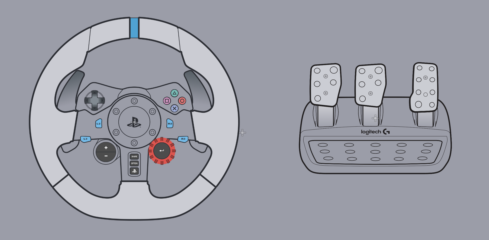
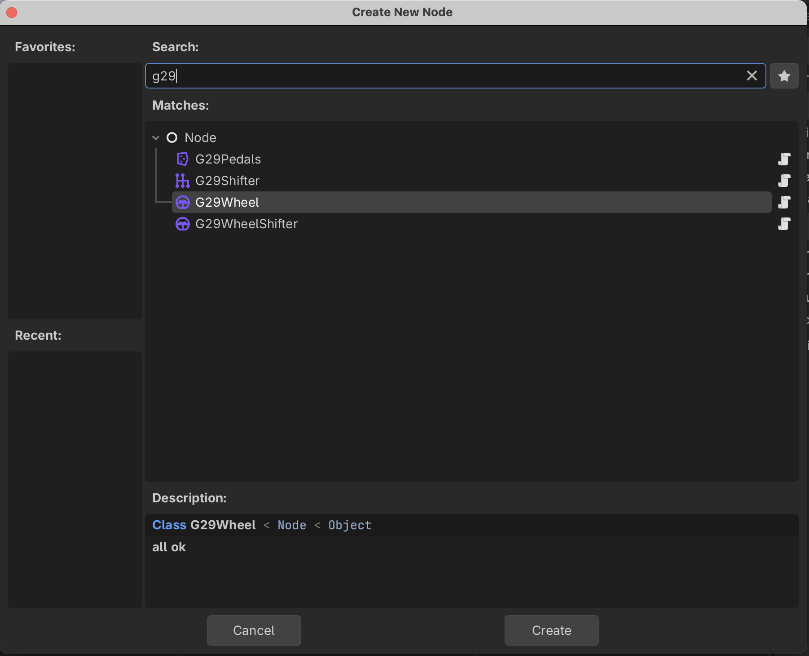
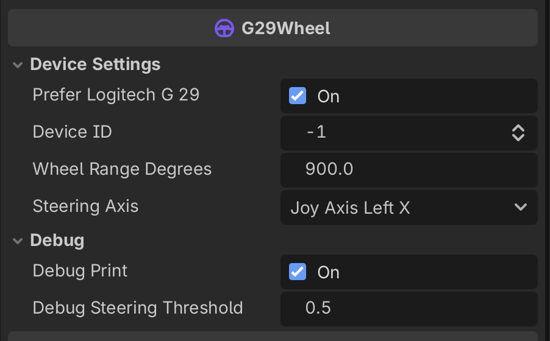
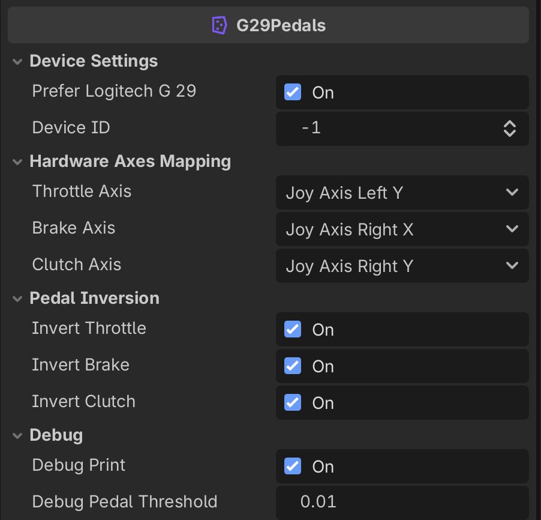
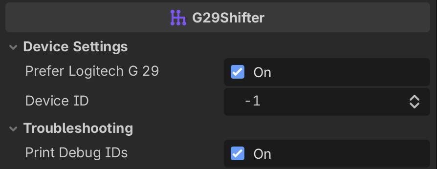

# Logitech G29 Godot 4 Addon (Beginner User Guide)

Use Logitech G29 wheel, pedals, and shifter in Godot with clean, ready-to-connect signals.


This is the included input visualization demo. It is the fastest way to confirm your setup works.

## Overview

This addon provides custom Godot nodes:

- `G29Wheel` (`scripts/G29Wheel.gd`)
- `G29Pedals` (`scripts/G29Pedals.gd`)
- `G29Shifter` (`scripts/G29Shifter.gd`)
- `G29WheelShifter` (`scripts/G29WheelShifterPriority.gd`) for wheel + H-pattern shifter overlap cases

What you get:

- Auto device picking (`prefer_logitech_g29`)
- Steering in degrees
- Pedal values normalized to `0.0 -> 1.0`
- Gear pressed/released signals
- Optional runtime pedal remapping

## Requirements

- Godot: **4.6** (detected from `project.godot`; works with Godot 4 APIs)
- Hardware: Logitech G29
- Optional hardware: Logitech Driving Force Shifter

## Installation (Step-by-Step)

1. Copy `addons/logitech_g29` into your Godot project.
2. Open your project in Godot.
3. Open any scene where you want wheel input.
4. Press **Add Node** (`+`) and search `G29`.
5. Add the nodes you need (`G29Wheel`, `G29Pedals`, `G29Shifter`).


Look for custom node names containing `G29`.

## Quick Start (Shortest Path)

1. Open this repo in Godot.
2. Run `scene/demo.tscn`.
3. Turn wheel, press buttons, press pedals.

Expected result:

- Wheel sprite rotates with steering.
- Wheel button sprites light up on press.
- Pedal sprites darken/brighten with pedal travel.

## Step-by-Step Setup (Demo Workflow)

This mirrors the working demo in `scene/demo.tscn` and `scene/controller.gd`.

1. Create a root `Node2D` scene.
2. Add child node `G29Wheel`.
3. Add child node `G29Pedals`.
4. Add a controller node (for example `Node2D`) and attach your script.
5. Add visual nodes/sprites for wheel and pedals (optional but useful).
6. Connect signals from `G29Wheel` and `G29Pedals` to controller methods.
7. In callbacks:
   - Rotate wheel visual from `steering_changed(degrees)`.
   - Change button sprite color on `*_pressed` and `*_released`.
   - Drive pedal visuals/game values from `throttle_changed`, `brake_changed`, `clutch_changed`.

Demo-style connection pattern:

```gdscript
extends Node2D

@onready var wheel_visual: Node2D = %wheel

func _ready() -> void:
    $G29Wheel.steering_changed.connect(_on_steering_changed)
    $G29Wheel.cross_pressed.connect(_on_cross_pressed)
    $G29Wheel.cross_released.connect(_on_cross_released)

    $G29Pedals.throttle_changed.connect(_on_throttle_changed)

func _on_steering_changed(degrees: float) -> void:
    wheel_visual.rotation_degrees = degrees

func _on_cross_pressed() -> void:
    %X.modulate = Color(2.0, 2.0, 2.0)

func _on_cross_released() -> void:
    %X.modulate = Color(1.0, 1.0, 1.0)

func _on_throttle_changed(value: float) -> void:
    %Throttle.modulate = Color(1.0 - value, 1.0 - value, 1.0 - value)
```

## Wheel Node (`G29Wheel`)

### What it does

- Reads steering axis and emits steering in degrees
- Emits pressed/released signals for wheel buttons, D-pad, paddles, and dial

### How to add it

1. Add node `G29Wheel`.
2. Keep defaults first.
3. Connect its signals to gameplay/controller script.

### Inspector options


Check device selection, steering axis, and debug settings.

| Option | Type | Default | What it controls | Beginner tip |
|---|---|---:|---|---|
| `prefer_logitech_g29` | `bool` | `true` | Prefers a joypad whose name contains `G29` or `Logitech`. | Keep enabled unless you need manual device selection. |
| `device_id` | `int` | `-1` | Selected Godot joypad ID. | Leave `-1`; it auto-selects at runtime. |
| `wheel_range_degrees` | `float` | `900.0` | Steering lock-to-lock range used to convert raw axis to degrees. | Keep `900` for stock G29 behavior. |
| `steering_axis` | `JoyAxis` | `JOY_AXIS_LEFT_X` | Axis read for steering. | Change only if your driver maps differently. |
| `debug_print` | `bool` | `true` | Prints wheel input events in console. | Turn off after setup. |
| `debug_steering_threshold` | `float` | `0.5` | Minimum steering delta (degrees) to print debug updates. | Increase if logs are noisy. |

### Signals

| Signal | Parameter type(s) | When it fires / use |
|---|---|---|
| `steering_changed(degrees)` | `float` | Steering degree changed. Use for steering visuals/vehicle logic. |
| `steering_raw_changed(value)` | `float` | Raw steering axis changed (`-1.0 .. 1.0`). |
| `cross_pressed` | `—` | Cross pressed. |
| `cross_released` | `—` | Cross released. |
| `circle_pressed` | `—` | Circle pressed. |
| `circle_released` | `—` | Circle released. |
| `square_pressed` | `—` | Square pressed. |
| `square_released` | `—` | Square released. |
| `triangle_pressed` | `—` | Triangle pressed. |
| `triangle_released` | `—` | Triangle released. |
| `dpad_up_pressed` | `—` | D-pad up pressed. |
| `dpad_up_released` | `—` | D-pad up released. |
| `dpad_down_pressed` | `—` | D-pad down pressed. |
| `dpad_down_released` | `—` | D-pad down released. |
| `dpad_left_pressed` | `—` | D-pad left pressed. |
| `dpad_left_released` | `—` | D-pad left released. |
| `dpad_right_pressed` | `—` | D-pad right pressed. |
| `dpad_right_released` | `—` | D-pad right released. |
| `l1_pressed` | `—` | L1 pressed. |
| `l1_released` | `—` | L1 released. |
| `r1_pressed` | `—` | R1 pressed. |
| `r1_released` | `—` | R1 released. |
| `l2_pressed` | `—` | L2 pressed. |
| `l2_released` | `—` | L2 released. |
| `r2_pressed` | `—` | R2 pressed. |
| `r2_released` | `—` | R2 released. |
| `l3_pressed` | `—` | L3 pressed. |
| `l3_released` | `—` | L3 released. |
| `r3_pressed` | `—` | R3 pressed. |
| `r3_released` | `—` | R3 released. |
| `share_pressed` | `—` | Share pressed. |
| `share_released` | `—` | Share released. |
| `options_pressed` | `—` | Options pressed. |
| `options_released` | `—` | Options released. |
| `ps_pressed` | `—` | PS pressed. |
| `ps_released` | `—` | PS released. |
| `plus_pressed` | `—` | Plus pressed. |
| `plus_released` | `—` | Plus released. |
| `minus_pressed` | `—` | Minus pressed. |
| `minus_released` | `—` | Minus released. |
| `dial_right_pressed` | `—` | Red dial turned right. |
| `dial_right_released` | `—` | Red dial right release. |
| `dial_left_pressed` | `—` | Red dial turned left. |
| `dial_left_released` | `—` | Red dial left release. |
| `dial_enter_pressed` | `—` | Red dial button pressed. |
| `dial_enter_released` | `—` | Red dial button released. |

### Functions / API

| Function signature | What it does | When to use | Short example |
|---|---|---|---|
| _No public function required_ | Node auto-detects device and emits signals. | Standard usage. | Connect signals in `_ready()`. |

```gdscript
func _ready() -> void:
    $G29Wheel.steering_changed.connect(_on_steering_changed)

func _on_steering_changed(degrees: float) -> void:
    steering_input = clamp(degrees / 450.0, -1.0, 1.0)
```

## Pedal Node (`G29Pedals`)

### What it does

- Reads throttle, brake, clutch axes
- Emits normalized values (`0.0 .. 1.0`)
- Emits raw values (`-1.0 .. 1.0`)
- Supports runtime pedal-axis mapping

### How to add it

1. Add node `G29Pedals`.
2. Connect `throttle_changed`, `brake_changed`, `clutch_changed`.
3. Toggle inversion options if pedal direction feels backward.

### Inspector options


Check axis mapping and inversion first if pedal behavior is incorrect.

| Option | Type | Default | What it controls | Beginner tip |
|---|---|---:|---|---|
| `prefer_logitech_g29` | `bool` | `true` | Prefers Logitech/G29-named device. | Keep enabled for most setups. |
| `device_id` | `int` | `-1` | Selected joypad ID. | Leave auto first. |
| `throttle_axis` | `JoyAxis` | `JOY_AXIS_LEFT_Y` | Axis used for throttle. | Remap if wrong pedal drives throttle. |
| `brake_axis` | `JoyAxis` | `JOY_AXIS_RIGHT_X` | Axis used for brake. | Check this if brake reads wrong. |
| `clutch_axis` | `JoyAxis` | `JOY_AXIS_RIGHT_Y` | Axis used for clutch. | Change if clutch does not respond. |
| `invert_throttle` | `bool` | `true` | Inverts throttle normalized output. | Toggle if values are reversed. |
| `invert_brake` | `bool` | `true` | Inverts brake normalized output. | Toggle if values are reversed. |
| `invert_clutch` | `bool` | `true` | Inverts clutch normalized output. | Toggle if values are reversed. |
| `debug_print` | `bool` | `true` | Prints pedal updates and mapping logs. | Turn off after setup. |
| `debug_pedal_threshold` | `float` | `0.01` | Minimum normalized change before debug prints. | Raise to reduce log spam. |

### Signals

| Signal | Parameter type(s) | When it fires / use |
|---|---|---|
| `throttle_changed(value)` | `float` | Normalized throttle changed (`0.0 .. 1.0`). |
| `brake_changed(value)` | `float` | Normalized brake changed (`0.0 .. 1.0`). |
| `clutch_changed(value)` | `float` | Normalized clutch changed (`0.0 .. 1.0`). |
| `throttle_raw_changed(value)` | `float` | Raw throttle axis changed (`-1.0 .. 1.0`). |
| `brake_raw_changed(value)` | `float` | Raw brake axis changed (`-1.0 .. 1.0`). |
| `clutch_raw_changed(value)` | `float` | Raw clutch axis changed (`-1.0 .. 1.0`). |
| `mapping_complete(pedal_name, axis_index)` | `String`, `int` | Emitted after successful runtime mapping. |

### Functions / API

| Function signature | What it does | When to use | Short example |
|---|---|---|---|
| `start_mapping_pedal(pedal_name: String) -> void` | Enters mapping mode and binds first strongly moved axis (`abs(value) > 0.5`). | Input settings/remapping menu. | `$G29Pedals.start_mapping_pedal("brake")` |

```gdscript
func _ready() -> void:
    $G29Pedals.throttle_changed.connect(_on_throttle_changed)
    $G29Pedals.mapping_complete.connect(_on_mapping_complete)

func _on_remap_brake_pressed() -> void:
    $G29Pedals.start_mapping_pedal("brake")

func _on_throttle_changed(value: float) -> void:
    throttle_input = value

func _on_mapping_complete(pedal_name: String, axis_index: int) -> void:
    print("Mapped %s to axis %d" % [pedal_name, axis_index])
```

## Shifter Node (`G29Shifter`)

### What it does

- Emits gear pressed/released for gears 1 to 6 and reverse
- Includes button-ID debug scanner for troubleshooting OS/driver mapping issues

### How to add it

1. Add node `G29Shifter`.
2. Connect gear signals to your transmission logic.
3. If reverse does not trigger, enable `print_debug_ids` and watch console output.

### Inspector options


Use this panel to verify device and enable ID debugging when needed.

| Option | Type | Default | What it controls | Beginner tip |
|---|---|---:|---|---|
| `prefer_logitech_g29` | `bool` | `true` | Prefers Logitech/G29-named device. | Keep enabled. |
| `device_id` | `int` | `-1` | Selected joypad ID. | Leave auto first. |
| `print_debug_ids` | `bool` | `true` | Prints all pressed button IDs (`0..63`) for troubleshooting. | Use this to diagnose reverse/gear mismatch. |

### Signals

| Signal | Parameter type(s) | When it fires / use |
|---|---|---|
| `gear_1_pressed` | `—` | Entered gear 1 slot. |
| `gear_1_released` | `—` | Left gear 1 slot. |
| `gear_2_pressed` | `—` | Entered gear 2 slot. |
| `gear_2_released` | `—` | Left gear 2 slot. |
| `gear_3_pressed` | `—` | Entered gear 3 slot. |
| `gear_3_released` | `—` | Left gear 3 slot. |
| `gear_4_pressed` | `—` | Entered gear 4 slot. |
| `gear_4_released` | `—` | Left gear 4 slot. |
| `gear_5_pressed` | `—` | Entered gear 5 slot. |
| `gear_5_released` | `—` | Left gear 5 slot. |
| `gear_6_pressed` | `—` | Entered gear 6 slot. |
| `gear_6_released` | `—` | Left gear 6 slot. |
| `gear_reverse_pressed` | `—` | Entered reverse (push down + reverse gate). |
| `gear_reverse_released` | `—` | Left reverse slot. |

### Functions / API

| Function signature | What it does | When to use | Short example |
|---|---|---|---|
| _No public function required_ | Node reads mapped shifter buttons and emits gear signals. | Standard usage. | Connect `gear_*` signals in `_ready()`. |

```gdscript
var current_gear := 0

func _ready() -> void:
    $G29Shifter.gear_1_pressed.connect(func(): current_gear = 1)
    $G29Shifter.gear_2_pressed.connect(func(): current_gear = 2)
    $G29Shifter.gear_reverse_pressed.connect(func(): current_gear = -1)
```

## Optional: `G29WheelShifter` (Wheel + Shifter Priority)

Use `G29WheelShifter` instead of `G29Wheel` if your shifter overlaps with D-pad inputs.

Extra option (all other options/signals are same as `G29Wheel`):

| Option | Type | Default | What it controls | Beginner tip |
|---|---|---:|---|---|
| `shifter_priority` | `bool` | `false` | Ignores overlapping D-pad IDs (`Down`, `Left`, `Right`) so shifter input wins. | Enable if shifting also triggers D-pad actions. |

## Demo Breakdown

Reference files:

- Scene: `scene/demo.tscn`
- Controller script: `scene/controller.gd`

How it is wired:

- `G29Wheel` and `G29Pedals` are children of the root scene.
- A `controller` node receives connected signals.
- Wheel button signals change sprite `modulate` (bright when pressed).
- `steering_changed` rotates the wheel visual (`rotation_degrees = degrees`).
- Pedal signals adjust sprite darkness based on `1.0 - value`.

This is the recommended baseline pattern:

- Keep input nodes simple
- Connect signals once in scene
- Put gameplay/visual reaction logic in dedicated callbacks

## Troubleshooting / FAQ

### Nothing happens when I move the wheel/pedals

- Connect device before running scene.
- Confirm node `device_id` is not `-1` during play.
- Keep `prefer_logitech_g29 = true`.
- Enable debug options and check console.

### Pedals move backward

- Toggle `invert_throttle`, `invert_brake`, `invert_clutch`.

### Wrong pedal axis is detected

- Use runtime mapping with `start_mapping_pedal("throttle" | "brake" | "clutch")`.
- Wait for `mapping_complete` signal.

### Shifter conflicts with D-pad

- Replace `G29Wheel` with `G29WheelShifter`.
- Set `shifter_priority = true`.

### Reverse gear does not trigger

- Physically push shifter down while moving into reverse gate.
- Turn on `print_debug_ids` and check which button ID appears.

## Example Use Cases

### 1) Basic steering + throttle + brake

```gdscript
extends Node3D

@onready var wheel: G29Wheel = $G29Wheel
@onready var pedals: G29Pedals = $G29Pedals

var steer_input := 0.0
var throttle_input := 0.0
var brake_input := 0.0

func _ready() -> void:
    wheel.steering_changed.connect(_on_steering_changed)
    pedals.throttle_changed.connect(func(v): throttle_input = v)
    pedals.brake_changed.connect(func(v): brake_input = v)

func _on_steering_changed(degrees: float) -> void:
    steer_input = clamp(degrees / 450.0, -1.0, 1.0)

func _physics_process(_delta: float) -> void:
    apply_steer(steer_input)
    apply_throttle(throttle_input)
    apply_brake(brake_input)
```

### 2) Manual transmission with clutch + shifter

```gdscript
extends Node

@onready var shifter: G29Shifter = $G29Shifter
@onready var pedals: G29Pedals = $G29Pedals

var current_gear := 0
var clutch_value := 0.0

func _ready() -> void:
    pedals.clutch_changed.connect(func(v): clutch_value = v)

    shifter.gear_1_pressed.connect(func(): _try_set_gear(1))
    shifter.gear_2_pressed.connect(func(): _try_set_gear(2))
    shifter.gear_3_pressed.connect(func(): _try_set_gear(3))
    shifter.gear_4_pressed.connect(func(): _try_set_gear(4))
    shifter.gear_5_pressed.connect(func(): _try_set_gear(5))
    shifter.gear_6_pressed.connect(func(): _try_set_gear(6))
    shifter.gear_reverse_pressed.connect(func(): _try_set_gear(-1))

func _try_set_gear(target: int) -> void:
    if clutch_value > 0.8:
        current_gear = target
```

### 3) Pedal remapping button in settings menu

```gdscript
extends Control

@onready var pedals: G29Pedals = $G29Pedals

func _ready() -> void:
    pedals.mapping_complete.connect(_on_mapping_complete)

func _on_map_throttle_pressed() -> void:
    pedals.start_mapping_pedal("throttle")

func _on_mapping_complete(pedal_name: String, axis_index: int) -> void:
    $StatusLabel.text = "Mapped %s to axis %d" % [pedal_name, axis_index]
```

<div style="border: 2px solid #ff4d4f; background: #fff1f0; padding: 10px; border-radius: 6px;">
  <strong>Note:</strong> This addon was partially created using AI.
</div>
